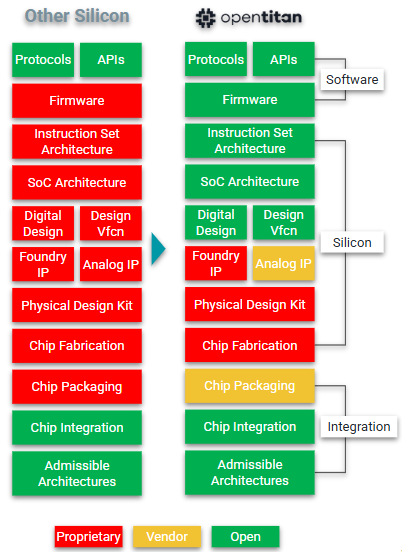

# OpenTitan Licensing

## Apache License
Unless otherwise noted, everything in the OpenTitan repository is covered by the Apache License, Version 2.0

Full text is available on [GitHub](https://github.com/lowRISC/opentitan/blob/master/LICENSE).

## Proprietary IP in an OpenTitan implementation

