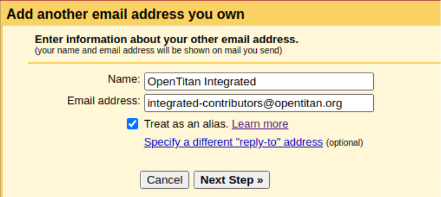

# Good Practices for Working Groups

This document outlines good practices for [OpenTitan Working Groups](./working_group.md).
It is written primarily as a guide for Working Group Chairs, but is also valuable to members of a Working Group.

In this document, "OpenTitan Working Group" is abbreviated to "OTWG".

# Regular meetings

## Scheduling meetings

- Find a slot for the OTWG meeting by coordinating with the [Technical Committee](./technical_committee.md).
The default interval for OTWG meetings is once every two weeks.

- Add a recurring event to the [OpenTitan Team calendar](https://calendar.google.com/calendar/embed?src=c_gfaeihutdj5bu6bvf5n9j3datc%40group.calendar.google.com) and invite *workgroup\-contributors@opentitan.org*.
Link to the meeting notes in the event description.
  - If you don't have that calendar yet, go to [https://calendar.google.com/calendar](https://calendar.google.com/calendar), then go to *Settings* (cogwheel symbol at the top on the right side) → *Add calendar* → *Subscribe to calendar* and enter *OpenTitan Team*.
  - Everyone in the [chairs@opentitan.org](mailto:chairs@opentitan.org) group has permission to modify the calendar.
If you don't have that permission, email [onboarding@opentitan.org](mailto:onboarding@opentitan.org).

## Maintaining meeting notes

- Create and maintain a Google Doc for meeting notes in the [OpenTitan.org / Meeting Notes / Working Groups folder](https://drive.google.com/drive/folders/1ipBZ7a5gm-QAa50u60pUnF566DHQfQLD).
Link sharing outside opentitan.org must be disabled.
The document should have *Internal* as File Classification label.

- Meeting notes must display the following notice at the top: "***Proprietary and/or confidential information should not be shared in these meeting notes.***"

- Chairs must ensure that meeting notes do not contain proprietary and/or confidential information.

- One meeting participant should be designated for taking notes by OTWG chairs at the beginning of the meeting.

- Meeting notes should be sufficiently detailed that people who could not attend the meeting can afterwards follow the gist of discussions and presentations.

## Composing the meeting agenda

- Carry over any agenda items from the previous meeting that couldn't be presented or discussed sufficiently.

- Keep a section at the top of the OTWG's meeting notes to collect topics.
Any OTWG participant can suggest topics by extending that list.
OTWG chairs decide on the priority of suggested topics and schedule them into the agenda.
This OTWG-visible approach is preferred over suggestions by email.
If topics are sensitive or confidential, they should be discussed by a restricted group first (e.g., the Security OTWG has cert-sensitive-priv@opentitan.org).

- Have a status update agenda item in which you or designated OTWG members communicate the current status and progress, major upcoming dates, and potential blockers or show stoppers – in line with [Milestone Tracking](https://docs.google.com/document/d/1HzAbDKCKgGM4IQWphULHoi8nx6c-ycfjM2eDdui-LtY/edit#bookmark=id.54sv2thyhhf6).

- If your OTWG has a *Hotlist* label on GitHub, add issues/PRs that have not been discussed before to the agenda and reach out to the contributor who added the *Hotlist* label asking them to present the item for discussion (or to get another contributor to present it).
  - If the hotlisted issues exceed the time budget, get in touch with the authors/labelers to determine their priority and exercise your judgment on the priority of an issue for the project.
In that case, keeping a queue of issues at the top of the meeting notes helps make this process transparent.

- Assign a time budget to each agenda item.

## Sending the meeting agenda

- Send the agenda for a regular meeting at least 24 hours in advance to the *workgroup\-contributors@opentitan.org* mailing list.
  - If the agenda is empty 72 hours before the meeting, you can send an email to the mailing list asking for agenda items.
If the agenda remains empty, cancel the meeting at least 24 hours in advance with an email to the mailing list and remove that week's occurrence (and *not* the entire recurring event) from the [OpenTitan Team calendar](https://calendar.google.com/calendar/embed?src=c_gfaeihutdj5bu6bvf5n9j3datc%40group.calendar.google.com).

- As the sender (“From:” field), use "OpenTitan *Workgroup \<workgroup\-contributors@opentitan.org\>*" and don’t sign the email with your name.
  - To have that option in the *From* field, you first have to [add the group as an email address in Gmail](https://support.google.com/groups/answer/10309372?hl=en).
We recommend settings similar to the following (replace integrated with your *workgroup* both in name and address):

# Chairing the meeting

- If regular participants don't know each other very well already, maintain a who-is-who list of meeting attendees.
This list can be part of the meeting notes or a document shared with chairs only, depending on privacy requirements and concerns.

- If a person who is not on the who-is-who list joins the meeting, kindly ask them to introduce themselves, stating their organization and role.
This serves two main purposes:
  - getting an overview of each individual's involvement, interest and expertise;
  - ensuring only current employees of active project partners are participating in meetings.

- If meeting rooms are present in the call, identify the persons by their face or by asking for their name.

## Moderating discussions

- Aim to give all meeting participants an opportunity to voice their point of view, and make sure different views on an issue (such as pros and cons) are well understood and captured in the notes.

- Also aim for productive discussions that result in a decision that allows the project to progress.

- At the end of each discussion, repeat the conclusion and ask if there are any objections.
This conclusion and any objections (or the absence of objections) have to be captured in the notes.

- If a discussion is blocked and progress in the workgroup is not possible or not at the pace required to meet deadlines, raise it to the [Technical Committee](./technical_committee.md).

## Updating issues

- Update any issues that have been discussed during a OTWG meeting with the outcome of the meeting.
Do not post non-public information in the issue, though.

# Mailing list

- Every OTWG has a mailing list, which is managed by its chairs.
Send an email to [onboarding@opentitan.org](mailto:onboarding@opentitan.org) asking to become a *Manager* for your OTWG's mailing list.

- Announcements and meeting agendas should be distributed via the mailing list.

# Related information

- [OpenTitan Working Groups Terms of Reference](./working_group.md)
