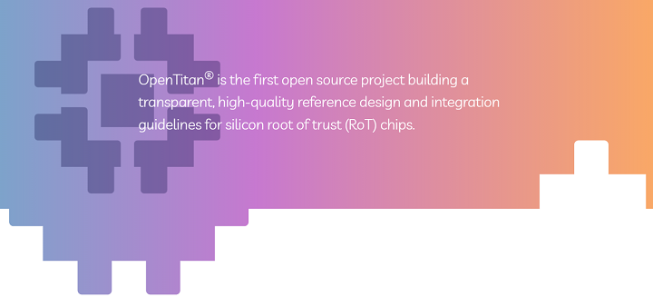

##  OpenTitan Software

This section is the landing spot for software documentation within the OpenTitan project.
Starting points are the [Reference Manual](./util/README.md) and [User Guide](./doc/getting_started/README.md) areas.

